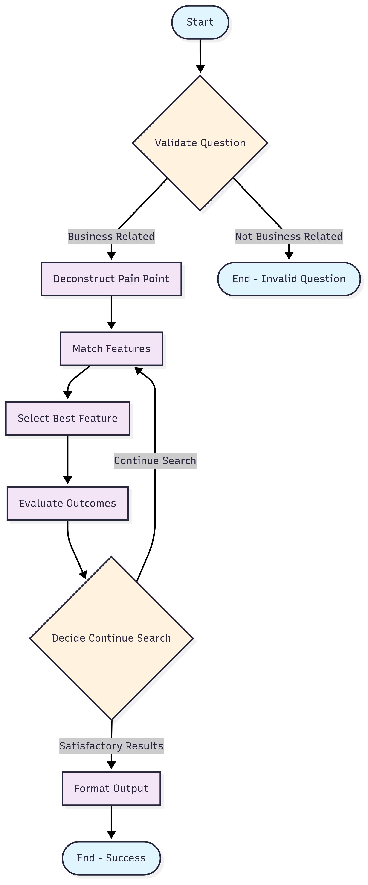

# Pain Point to Solution Agent

An AI system that analyzes business problems and suggests relevant features from the Filum.ai platform using RAG (Retrieval Augmented Generation) approach.

## Overview

This system:
- Analyzes business pain points
- Matches problems with relevant features
- Provides detailed solutions with relevance scores
- Uses semantic search with ChromaDB and Google's Generative AI

## Prerequisites

- Python 3.8+
- Virtual environment (recommended)

## Installation

1. Clone the repository:
```bash
git clone <repository-url>
cd filum-agent
```

2. Create and activate a virtual environment (optional but recommended):
```bash
python -m venv venv
# On Windows
venv\Scripts\activate
# On Unix/MacOS
source venv/bin/activate
```

3. Install required packages:
```bash
pip install -r requirements.txt
```

## Configuration

1. Set up Google API credentials:
- Get your Google API key
- Set it as an environment variable:

## Usage

Using Python script:
```bash
python agentic_rag_agent.py
```

## Project Structure

- `Agents.ipynb`: Main notebook with agent implementation
- `agentic_rag_agent.py`: Python script version of the agent
- `knowledge_base.json`: Feature database
- `chroma_db/`: Vector store directory
- `Report.tex`: Detailed system design documentation
 

```


## Author

Chien Nguyen
Email: Nguyentatchien9564@gmail.com

